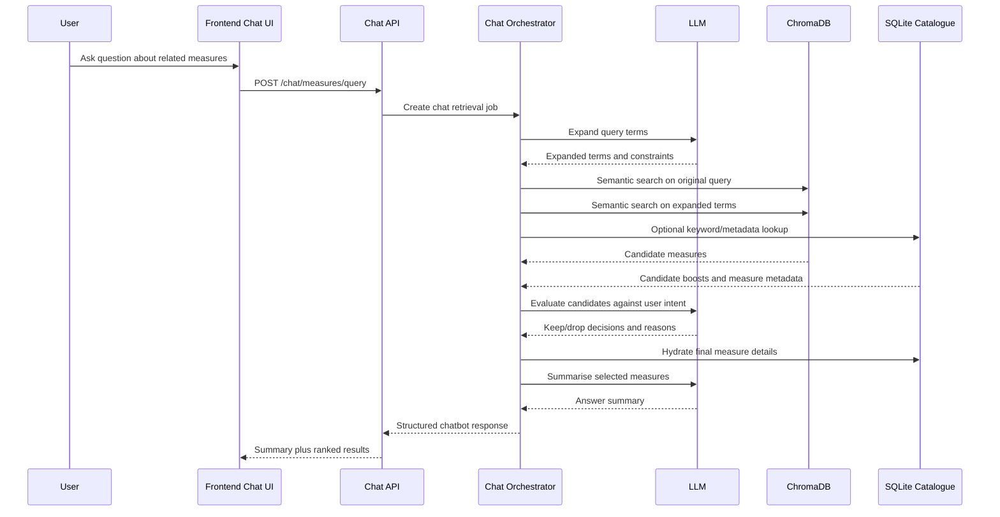

# Chatbot Retrieval Architecture

## Purpose

This document describes a chatbot-oriented architecture for the Australian budget catalogue.

The goal is to support prompts such as:

> Tell me about measures related to housing affordability.

The chatbot should use the existing catalogue as the source of truth, retrieve candidate measures with ChromaDB-backed semantic search, use an LLM to judge which results match the user intent, and return both structured results and a concise narrative summary.

This is a retrieval-and-synthesis workflow, not an open-ended generative chatbot. The catalogue remains the authoritative data source.

## Target User Flow

1. The user asks a natural-language question about budget measures.
2. The system extracts or generates search terms related to the query.
3. The system runs semantic retrieval against the ChromaDB measure index.
4. The system optionally combines semantic retrieval with existing SQLite keyword filters.
5. The LLM reviews the retrieved candidates and keeps only the measures that match the user intent.
6. The system returns:
   - a ranked list of matching measures
   - a short summary of what those measures have in common
   - brief per-measure explanations tied back to source data

## Design Principles

- Keep retrieval grounded in catalogue data, not in model memory.
- Use the LLM as a query planner, relevance judge, and summariser.
- Keep deterministic retrieval and filtering separate from probabilistic LLM steps.
- Return source-linked results before or alongside any generated summary.
- Preserve the existing measure detail model so the chatbot can hand off to the current detail pages and API.

## Logical Architecture

### 1. Chat Interface Layer

Responsibilities:
- accept free-text user questions
- show answer text, cited measures, and follow-up actions
- preserve conversational context for one session

Initial implementation options:
- a dedicated frontend chatbot page
- or a chatbot panel layered onto the existing catalogue search UI

### 2. Chat Orchestrator

Responsibilities:
- receive the user question
- invoke query expansion
- call retrieval services
- call LLM relevance filtering
- assemble the final response payload

This component should live in the backend as an explicit service rather than inside a controller or frontend hook.

### 3. Query Expansion Stage

Responsibilities:
- transform the user question into one or more retrieval queries
- produce synonyms, related policy phrases, and domain-specific keywords
- preserve important constraints from the question, such as portfolio, time period, or policy area

Example:

- User asks: `Tell me about measures related to housing affordability`
- Expanded terms:
  - `housing affordability`
  - `social housing`
  - `rent assistance`
  - `home ownership`
  - `housing supply`
  - `affordable housing`

This stage can be implemented with either:
- a lightweight prompt to an LLM
- or a deterministic rules layer plus optional LLM enrichment

### 4. Retrieval Layer

Responsibilities:
- run semantic search over indexed measure text in ChromaDB
- optionally blend with keyword results from SQLite
- return a bounded candidate set for LLM review

Recommended retrieval flow:

1. Search ChromaDB using the original user query.
2. Search ChromaDB using expanded terms.
3. Merge and deduplicate measure candidates.
4. Optionally boost measures that also match the SQLite keyword search.
5. Trim to a candidate window, for example top 20 to 40 measures.

Why use both stores:
- ChromaDB is the best fit for semantic similarity across measure text.
- SQLite remains useful for canonical measure metadata, exact filtering, and detail hydration.

### 5. LLM Relevance Filter

Responsibilities:
- inspect candidate measures against the original user intent
- exclude near matches that are topically related but not actually responsive
- attach a short relevance rationale for each kept measure

This stage should not invent new measures. It should only classify or rank the measures returned by retrieval.

Recommended prompt inputs:
- original user question
- optional conversation context
- expanded search terms
- candidate measure title
- portfolio
- budget round
- excerpt or truncated full measure text

Recommended outputs per candidate:
- `keep: true | false`
- `relevance_score: 0-1`
- `reason: short text`

### 6. Response Synthesis Stage

Responsibilities:
- summarise the selected measures in plain language
- surface common themes, differences, and notable caveats
- produce a user-facing answer without losing traceability to source records

The answer payload should include both generated and structured content:

- `answer_summary`
- `results[]`
  - `measure_id`
  - `measure_title`
  - `portfolio_name`
  - `budget_round`
  - `match_reason`
  - `source_page`
- `follow_up_suggestions[]`

## End-to-End Sequence



## Proposed Backend Components

Suggested additions under the current backend structure:

```text
backend/app/
  api/
    routers/
      chat.py
  domain/
    chat/
      models.py
      service.py
      prompts.py
    search/
      query_expansion.py
      relevance_filter.py
  infrastructure/
    vector/
      chroma_measure_index.py
    llm/
      client.py
```

### Component Responsibilities

- `chat.py`
  - accepts chatbot requests and returns typed responses
- `domain/chat/service.py`
  - orchestrates expansion, retrieval, filtering, and synthesis
- `domain/chat/models.py`
  - defines request, candidate, and response contracts
- `infrastructure/vector/chroma_measure_index.py`
  - wraps Chroma collection access and candidate retrieval
- `infrastructure/llm/client.py`
  - wraps the chosen model provider and prompt execution

## Proposed API Contract

### Request

```json
{
  "question": "Tell me about measures related to housing affordability",
  "conversation_context": [],
  "limit": 8
}
```

### Response

```json
{
  "question": "Tell me about measures related to housing affordability",
  "expanded_terms": [
    "housing affordability",
    "social housing",
    "rent assistance",
    "housing supply"
  ],
  "answer_summary": "The strongest matches focus on housing supply, rental support, and social housing delivery across multiple budget rounds.",
  "results": [
    {
      "measure_id": 123,
      "measure_title": "Example measure",
      "portfolio_name": "Housing",
      "budget_round": "2025-26 Budget",
      "match_reason": "Directly targets rental affordability and housing supply.",
      "source_page": 97,
      "relevance_score": 0.91
    }
  ]
}
```

## Data Dependencies

The chatbot architecture depends on two data paths:

### Structured catalogue in SQLite

Used for:
- canonical measure IDs
- title, portfolio, budget round, and source page metadata
- measure detail hydration for returned results

### Semantic index in ChromaDB

Used for:
- semantic nearest-neighbour search over measure text
- retrieval of candidates that do not rely on exact keyword overlap

Recommended indexed payload per Chroma document:
- `measure_id`
- `measure_title`
- `portfolio_name`
- `budget_round`
- `document_section`
- `full_measure_text`
- optional derived synopsis for shorter embeddings

## Current-State Fit

This repository already has the main prerequisites for the architecture:

- structured measure data in SQLite
- a typed measure API and detail model
- ChromaDB as a declared dependency
- local data directories for both SQLite and Chroma data

What is still missing in the current implementation:

- a backend chat endpoint
- a Chroma retrieval adapter in the application code
- an LLM integration layer
- typed contracts for chatbot responses
- evaluation logic for candidate relevance

That makes this a realistic next-stage architecture for a competition submission: it extends the existing catalogue instead of replacing it.

## Safety and Quality Controls

- Bound the candidate set before sending content to the LLM.
- Keep the original user question in every LLM evaluation prompt.
- Return only measures that already exist in the catalogue database.
- Include source metadata with every result to support inspection.
- Log expanded terms, candidate counts, and kept result counts for debugging.
- Fall back to plain retrieval results if the LLM filtering step fails.

## Evaluation Plan

Success should be measured on retrieval quality, not just answer fluency.

Track at least:
- query-to-result relevance
- false positives after LLM filtering
- coverage of obviously relevant measures
- answer faithfulness to selected results
- latency across expansion, retrieval, filtering, and summarisation

Recommended test set:
- 20 to 50 representative policy questions
- expected relevant measures for each question
- edge cases with ambiguous or broad policy terms

## Recommended Delivery Scope

For the competition submission, the smallest convincing implementation is:

1. Add a single chatbot endpoint for measure discovery.
2. Implement Chroma retrieval over full measure text.
3. Add LLM-based query expansion.
4. Add LLM-based keep/drop filtering for retrieved candidates.
5. Return a short answer summary plus a cited result list.

This gives a genuine chatbot workflow while keeping the system grounded in the existing catalogue and data model.